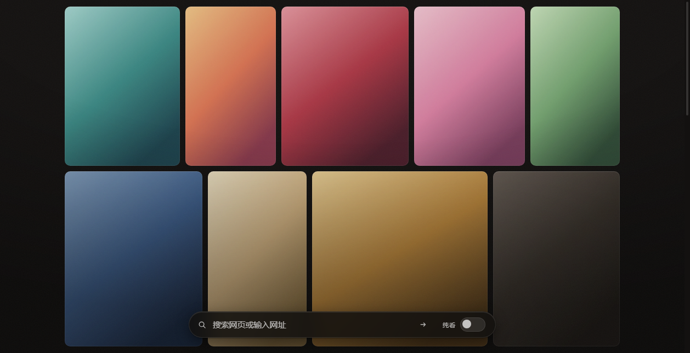
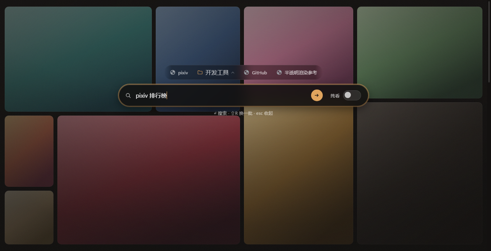
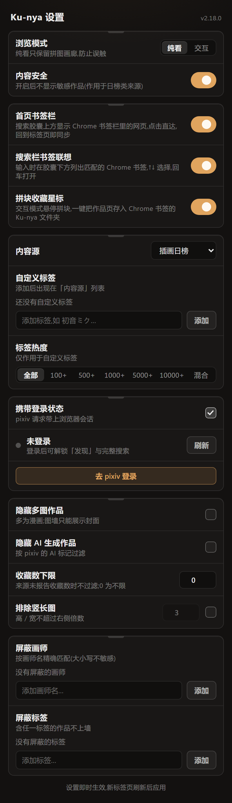

# ACG-Chrome-plugin（Ku-nya 衍生版）

A Chrome extension for pixiv lovers: it picks up illustrations from the pixiv
ranking and displays them on your new tab — as a gapless, zero-crop **puzzle
wall** that reveals itself screen by screen as you scroll.





> 截图说明 / About these screenshots: 为保护画师版权，截图中的插画均以程序
> 生成的渐变占位，实际使用中显示的是 pixiv 榜单/标签/推荐的真实插画。
> To respect the artists' copyright, every illustration in these screenshots is
> replaced with a generated gradient; in real use the wall shows actual artwork
> from pixiv rankings, tags, and recommendations.（生成脚本 / generator:
> `node test/shot-readme.mjs`）

> **声明 / Credits**
>
> 本项目是 [tamanobi/Ku-nya](https://github.com/tamanobi/Ku-nya)（作者 Kohki
> YAMAGIWA）的衍生作品，原作以 **Apache License 2.0** 发布；本仓库完整保留原
> `LICENSE`，并在提交历史中保留原作的全部开发记录。在此向原作者致谢。
>
> This repository is a derivative work of
> [tamanobi/Ku-nya](https://github.com/tamanobi/Ku-nya) by Kohki YAMAGIWA,
> originally released under the **Apache License 2.0**. The original `LICENSE`
> is retained verbatim and the upstream development history is preserved in
> this repository's git history. All credit for the original project goes to
> its author.
>
> 本衍生版的主要改动 / What this derivative adds:
>
> - **Manifest V3 迁移**（见 [MIGRATION-MV3.md](MIGRATION-MV3.md)）
> - 「暗房」视觉系统：暖调近黑画布 + 底部磨砂搜索胶囊，聚焦时胶囊升起、图墙压暗（见 [DESIGN.md](DESIGN.md)）
> - **精确拼合拼图墙**：以二叉空间分割（BSP，i3/bspwm 式）为每张图分配与原图
>   宽高比严格相等的格子，零裁切、零拉伸、灰缝均匀（`src/lib/tiling.ts`）
> - **渐进式加载**：一视口一屏拼图，下滑逐屏追加、拼块入屏逐块渐入；首载遇网络
>   热身期会静默重试，不再闪现空态
> - **自定义标签分类**：任意 pixiv 标签成为内容源，按需翻页续取（不止首页 120 张）；
>   无热度档走 `s_tag_full` 服务端精确匹配，带热度档走模糊搜索 + 客户端精确过滤，
>   无关作品不上墙
> - **标签热度分层**：`Nusers入り` 收藏门槛（100–10000 单档或四档混合），免费账号
>   也能按热度筛图
> - **算法推荐源（discovery）**：pixiv「みつける」推荐信息流，登录即可用的高热
>   内容源，无需 Premium
> - **pixiv 登录会话**：可开关请求携带登录状态（按账号浏览设置返回，含 R-18 开关），
>   弹窗实时探测并显示登录态
> - **过滤三件套**：一键剔除多页作品（多为漫画，墙上只能展示封面）、按 pixiv 标记
>   剔除 AI 生成作品、按收藏数下限筛图（来源未报告收藏数时不过滤）；另可按画师名
>   屏蔽——四者与屏蔽标签、安全级、宽高比一样，对所有内容源生效
> - **设置面板「暗房延伸」**：popup 与新标签页同一套暗房材质——底片片夹式分组卡片、
>   琥珀只给开态开关与焦点、登录态琥珀呼吸点
> - **Chrome 书签联动**：交互模式悬停拼块，一键把作品页收藏进 Chrome 书签的
>   Ku-nya 文件夹（随浏览器同步，再点即移除）；搜索时输入即列出匹配的 Chrome
>   书签，`↑↓` 选择、回车直达——两者都是普通 Chrome 书签，书签管理器里可见可整理
> - **首页书签栏**：搜索胶囊上方一排 Chrome 书签镜像（favicon + 标题，书签栏
>   优先、「其他书签」在后；文件夹保持分组，点开是玻璃菜单），点击直达常去的
>   网页；不持自有数据，新开标签页或回到标签页时自动重读，在 Chrome 里整理书签
>   即时跟随，可在 popup 整体关闭
> - 键盘流：`/`、`Ctrl/Cmd+K` 聚焦搜索，任意字符直接开搜，`⇧R` 换一批，`Esc` 收起
> - 图源修复：统一归一化为等比 `master` 图（修复 `_custom` 方图缩略图导致的
>   拉伸），分辨率提升至 `600x1200_90`
> - 插画均来自 pixiv 公开榜单与公开搜索/推荐接口，版权归原作者及 pixiv 所有；
>   本扩展仅作展示与跳转，不存储、不分发图片内容

## Build

```bash
yarn install
yarn build
```

`yarn build` writes the extension to `release/`; `yarn dev` rebuilds on change.
Any current Node.js works, 17 and later included.

## Install

1. Open `chrome://extensions`
2. Turn on **Developer mode**
3. Choose **Load unpacked** and select the `release` directory

Chrome 137 and later ignore `--load-extension` in branded builds, so that page
(or the Web Store) is the only way in.

## Compatibility

Manifest V3, which is what current Chrome runs; the previous Manifest V2 build
is in the history. [MIGRATION-MV3.md](MIGRATION-MV3.md) records what changed and
why.

## What it does

- Opens on a full-viewport **puzzle wall** of random illustrations from the pixiv
  daily ranking: every tile is shaped to its image's exact aspect ratio, so
  nothing is ever cropped or stretched; one wheel gesture turns exactly one
  screen of the puzzle (like slides), and each piece ripples into place as it
  enters view
- The content source is yours: the popup picks among the built-in rankings
  (illust / manga / original / ugoira / newer / popular), the **discovery feed**
  (pixiv's own recommendation stream — the best source of high-heat works short
  of Premium; it needs your pixiv login, which the popup can carry and detects),
  or any **custom tag category** you define — each tag you add becomes a choice in
  the Ranking Mode dropdown and turns the wall into that tag's latest search
  results, paged deeper on demand as you scroll. Tag sources can carry a
  **bookmark-tier filter** (`Nusers入り`, a single tier or a layered mix) so only
  works above a popularity floor reach the wall, and matching is exact: plain tag
  searches use pixiv's exact mode, tiered searches re-check every entry's tags
  client-side, so unrelated fuzzy matches never make it onto the wall. Popup
  filters hide **multi-page works** (usually manga, whose wall tile could only
  show the cover), **AI-generated works** (pixiv's own aiType flag), anything
  below a **bookmark floor** (sources that don't report counts pass through),
  and any **muted author** — on top of the muted-tag, safety and aspect-ratio
  filters, across every source
- A frosted search capsule sits at the bottom centre and searches **the web** with
  your default search engine (what the address bar does); anything that looks like
  an address is opened directly. Focusing it makes the capsule **rise to the
  spotlight position** (38% viewport height) while a warm scrim dims the wall —
  search takes the room only while you are searching. A search button on the
  capsule lights up in amber as soon as there is text to send
- The switch on the capsule toggles between **纯看 / watch** — illustrations are not
  clickable at all, so the page can be scrolled without opening anything by accident
  — and **交互 / interactive**, where they link to the artwork page. The choice is
  remembered, and the popup exposes it too
- The settings popup wears the same darkroom as the wall: film-sleeve group
  cards, the amber reserved for the on-switch, focus rings and the login pulse
- **Chrome bookmarks, wired in**: hovering a tile in interactive mode reveals a
  star that files the artwork page into a `Ku-nya` folder in your Chrome
  bookmarks (they sync like anything you saved by hand; click again to remove),
  and typing in the search capsule lists matching bookmarks under it — `↑↓` to
  pick, Enter opens the pick, while an unpicked Enter stays a plain web search
- **A bookmark strip on the homepage**: your Chrome bookmarks — the bookmarks
  bar first, Other Bookmarks after, since Chrome's own star button files
  there — are mirrored as a quiet row of favicon chips above the search
  capsule, one click away from your usual sites. Folders stay folders: a
  folder chip opens a small glass menu of its links (nested folders flatten
  into the parent menu), so tidying is rewarded with organisation instead of
  a longer row. The strip holds no data of its own — the bar is re-read
  whenever a tab opens or regains focus (and on `chrome.bookmarks.onChanged`
  where the platform delivers it), so reorganising bookmarks in Chrome is
  reflected the moment you come back, and the popup can hide the strip
  entirely
- `/` or `Ctrl/Cmd+K` focuses the search field, any printable character starts a
  query, `Shift+R` deals a fresh wall, `Esc` clears and steps out; in watch mode
  the capsule steps back to a ghost while the pointer is still and returns the
  moment you move

See [DESIGN.md](DESIGN.md) for the visual system it implements.

## The new tab footer, and `theme-darkroom/`

Since Chrome 138, Chrome draws its own footer on a new tab page that an
extension has taken over, crediting that extension. It is browser UI: it is not
part of this page, no stylesheet here can reach it, and the only switch Chrome
exposes is an enterprise policy (`NTPFooterExtensionAttributionEnabled`), which
also pins the "managed by your organisation" badge on the browser.

`theme-darkroom/` is the cheaper answer. Chrome's new tab surfaces take their
colours from the browser theme (`chrome://theme/colors.css`), so a minimal theme
that sets the new tab colours to the page's own `#131110` makes that footer
blend into the page:

1. `chrome://extensions` → **Developer mode** → **Load unpacked**
2. Select the `theme-darkroom` directory

It sets only `ntp_background`, `ntp_text`, `ntp_header` and `ntp_link`, so the
rest of the browser chrome keeps whatever look it has now. Installing a theme
does replace the currently active one; to undo, use **Reset to default** in
`chrome://settings/appearance` (or re-apply the previous theme).

## Test

```bash
node test/e2e.mjs
```

Starts a throwaway Chrome with its own profile, loads `release/` unpacked,
and exercises the new tab page and popup end to end. Set `CHROME_PATH` if Chrome
is not in the default location, `KUNYA_HEADFUL=1` to watch it run.

```bash
node test/measure-distortion.mjs
```

Measures the rendered aspect ratio of every gallery image against the source
pixels — the puzzle wall's zero-crop / zero-stretch contract, verified in a
real browser.
